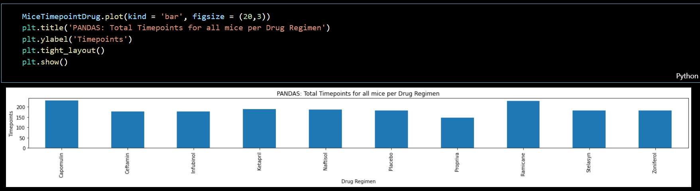
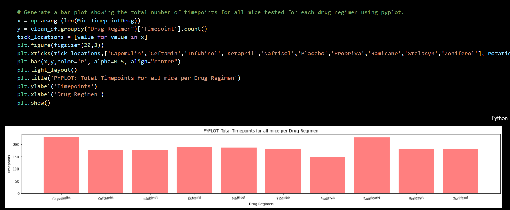
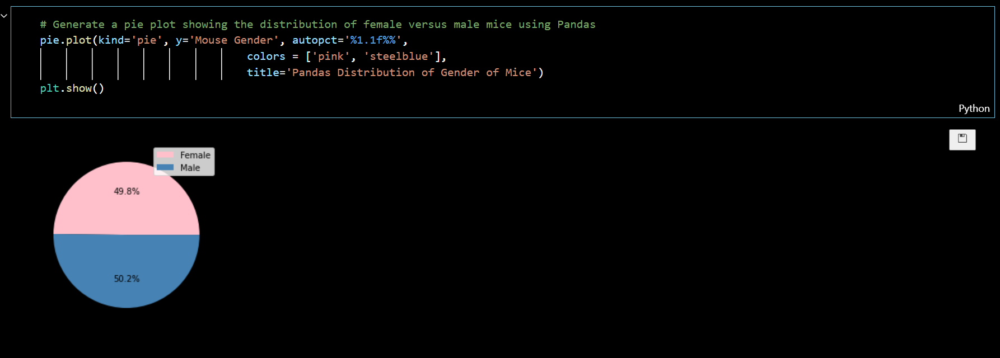
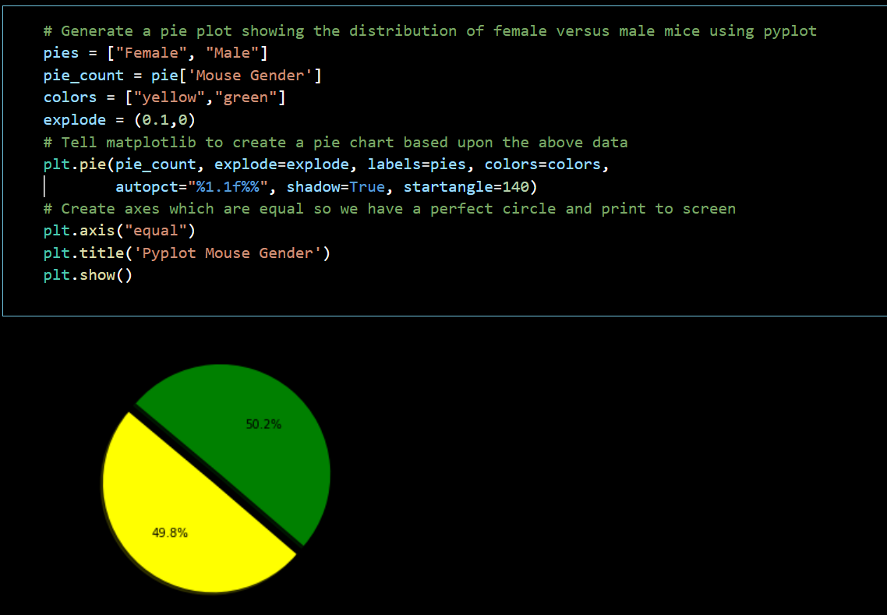
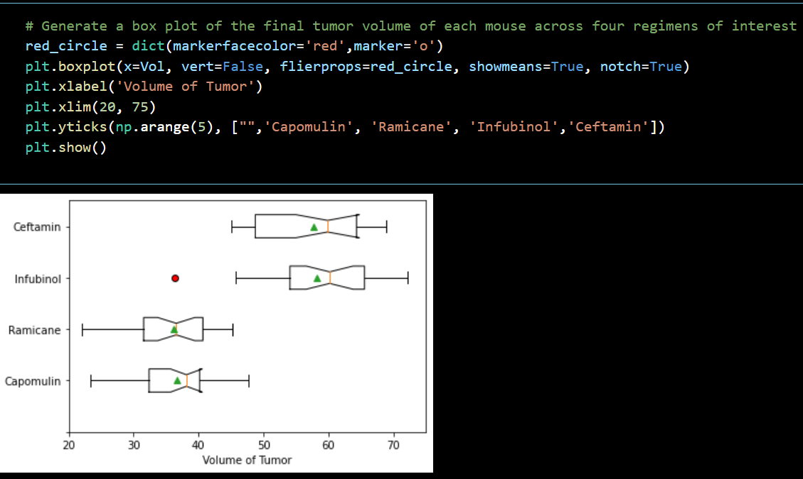
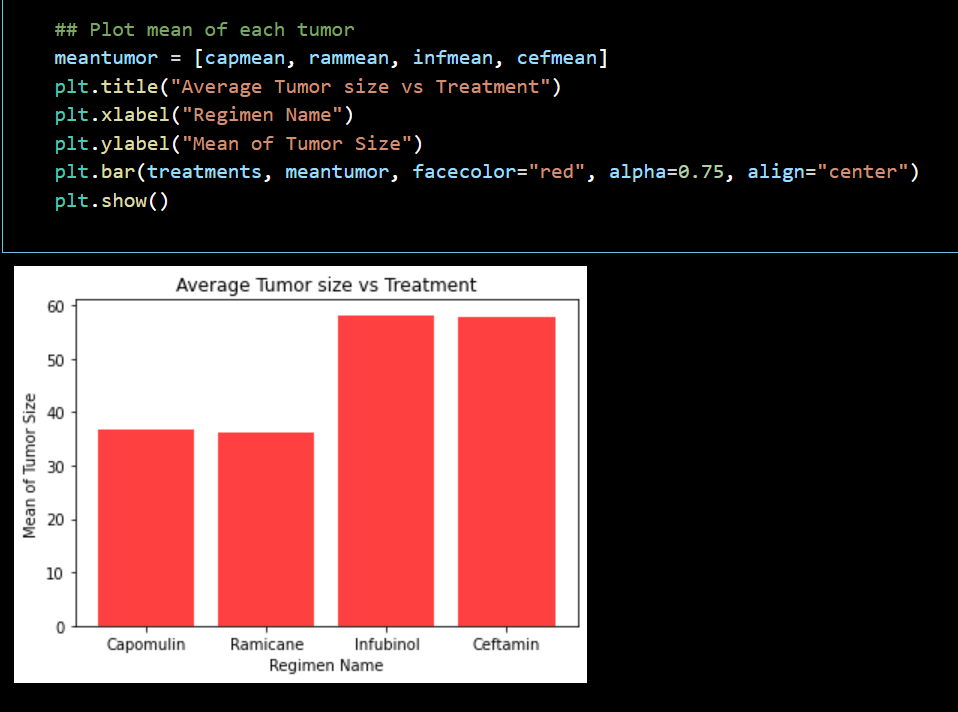
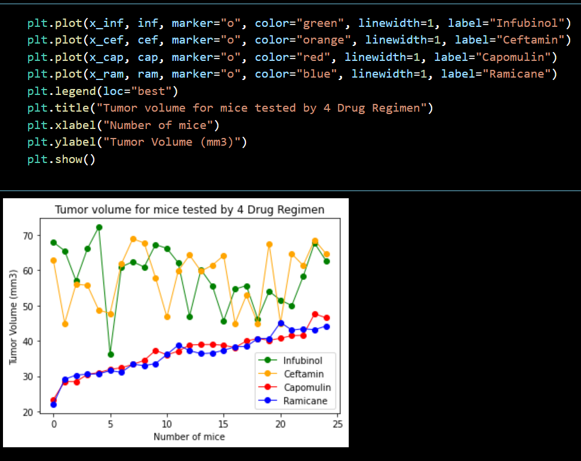
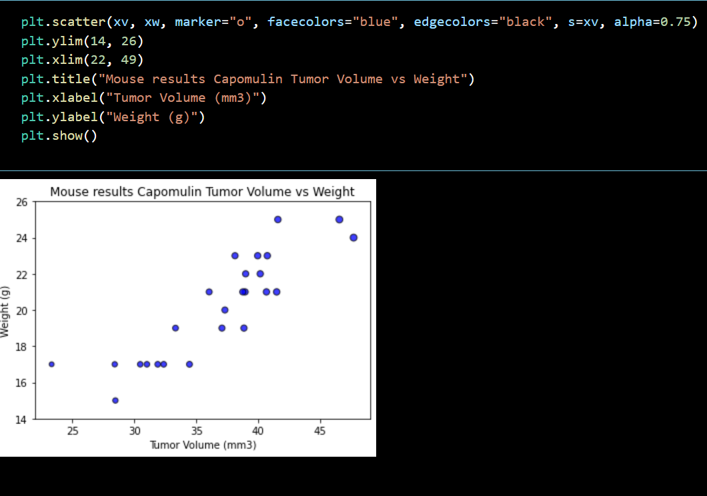
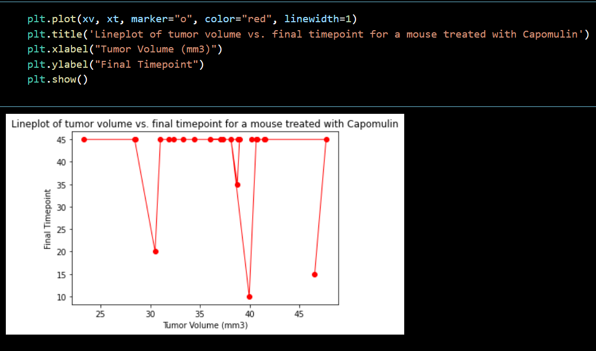
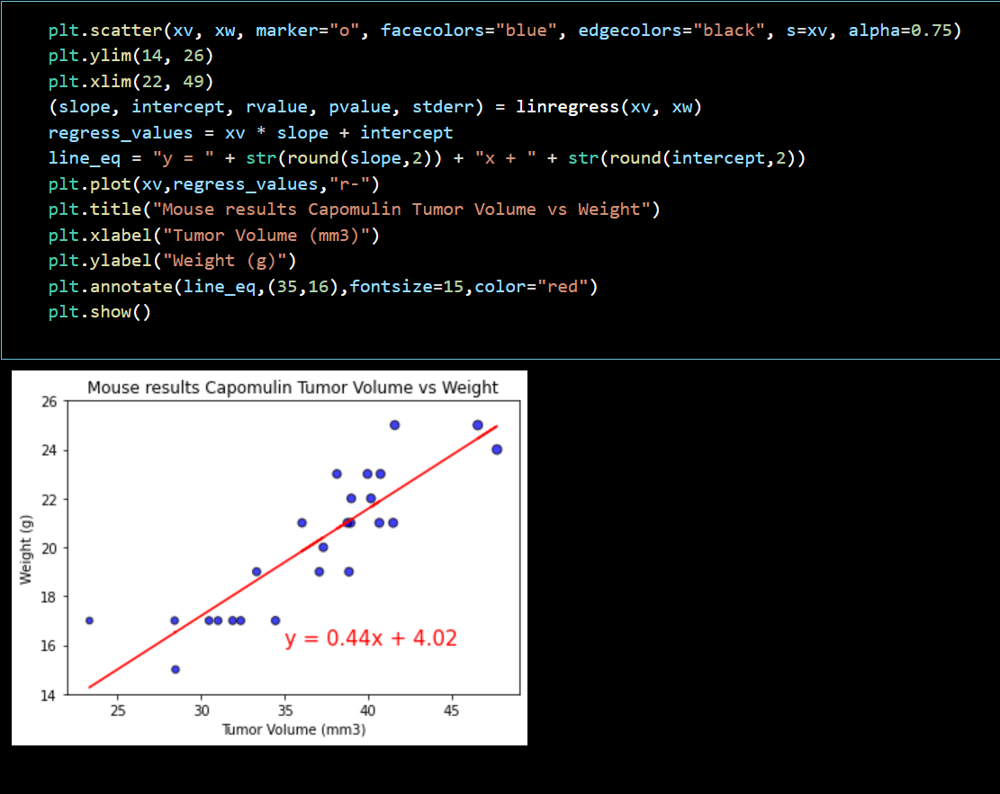

# matplotlib-challenge "The Power of Plots"

Pymaceuticals specializes in anti-cancer pharmaceuticals. In its most recent efforts, it began screening for potential treatments for squamous cell carcinoma (SCC), a commonly occurring form of skin cancer.

In this most recent animal study, 249 mice identified with SCC tumor growth were treated through a variety of drug regimens. Over the course of 45 days, tumor development was observed and measured. The Pymaceuticals' drug of interest, Capomulin, was compared to the other treatment regimens. A technical report of the study was needed to form a top-level summary of the results.

Overall, it is clear that Capomulin is a viable drug regimen to reduce tumor growth.
Capomulin had the most number of mice complete the study, with the exception of Remicane, all other regimens observed a number of mice deaths across the duration of the study.

The pie charts shows that the mice sampled are equally distributed across genders.

The box plot and line plots of the final tumor volume of each mouse across four regimens of interest shows that tumor volumes are higher for Capomulin and Ramicane. Infubinol has one lower outlier.

The line plot of tumor volume vs. time point for a mouse treated with Capomulin shows a concentration of timepoints around 45. The mean of 41 and the median of 45 confirms this. The correlation coefficent is negative 0.22.

The tumor volume vs mouse weight is positively correlated for the mice treated with Capomulin. The tumor volume increases as the mouse weight increases. This is shown in the scatter plot. The correlation coeficient is positive 0.88.

The Git repository main code is found in folder Pharmaceuticals [maincode](Pymaceuticals/pymaceuticals_main_code.ipynb). This folder also contains the data. Jupyter notebook was utilised to write and test code. Final Analysis/Observations are included at the top of this notebook.

